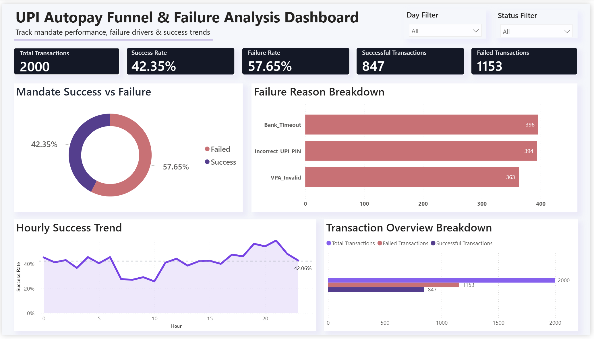

# UPI Autopay Funnel & Failure Analysis Dashboard

## Overview
Built an interactive Power BI dashboard analyzing 2,000+ synthetic UPI Autopay mandate transactions to identify failure patterns, operational bottlenecks, and success trends.

## Tools Used
- Power BI
- SQL
- DAX
- Excel

## Key Features
- KPI dashboard
- Funnel analysis
- Failure breakdown analysis
- Hourly success trend analysis
- Interactive slicers

## Key Insights
- Bank Timeout contributed ~34% of failures
- Evening hours showed higher success rates
- Smart retry logic could improve success rate from 42% to ~52%

## Dashboard Preview

